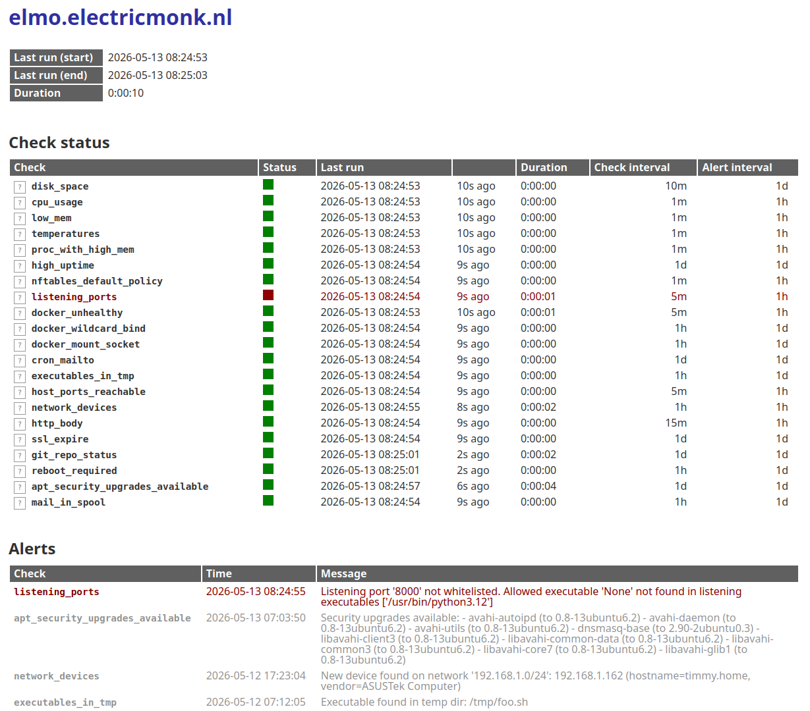

Monitoring tool where you write checks in Python instead of some declarative
markup language. Simple, fast and powerful. No external libraries required,
only a Python installation.

MonPy provides tooling to easily write checks, keep state and history and
generate alerts. Various useful data [collectors](#collectors) are provided
out-of-the-box.

See [`checks.py`](checks.py) for examples of what's possible and how to write
checks.

# Usage

    $ ./checks.py --help
    usage: monpy [-h] [--version] [-v] [-f] [--no-alert] [--no-suppress] [--log-file PATH] [CHECK]

    positional arguments:
      CHECK            Check to run. If not given, runs all checks

    options:
      -h, --help       show this help message and exit
      --version        show program's version number and exit
      -v, --verbose    Verbosity. May be specified multiple times (-vvv)
      -f, --force      Force checks to run
      --no-alert       Don't send alerts (see them using -vvv)
      --no-suppress    Ignore alert interval and do not suppress alerts
      --log-file PATH  Log to file. If not given, log to stderr

cronjob:

    * * * * * cd /opt/monpy && ./checks.py

Example ouput (`-vvv` verbose mode):

    2026-05-03 11:12:08,392     INFO check | Running check 'docker_wildcard_bind'
    2026-05-03 11:12:08,394     INFO root | Supressing alert for 'docker_wildcard_bind'. Alert interval (86400s) not reached (1318s elapsed). Alert: Container 'nextcloud-aio-mastercontainer' exposes port 8080/tcp on all interfaces (0.0.0.0)
    2026-05-03 11:12:08,395     INFO check | Running check 'nftables_default_policy'
    2026-05-03 11:12:08,401     INFO check | Running check 'docker_mount_socket'
    2026-05-03 11:12:08,402     INFO root | Supressing alert for 'docker_mount_socket'. Alert interval (86400s) not reached (1380s elapsed). Alert: Container 'nextcloud-aio-watchtower' mounts the docker socket in the container
    2026-05-03 11:12:08,402     INFO root | Supressing alert for 'docker_mount_socket'. Alert interval (86400s) not reached (1380s elapsed). Alert: Container 'nextcloud-aio-mastercontainer' mounts the docker socket in the container
    2026-05-03 11:12:08,403     INFO check | Running check 'proc_with_high_mem'
    2026-05-03 11:12:08,494     INFO check | Running check 'low_mem'
    2026-05-03 11:12:08,494     INFO check | Running check 'mail'
    2026-05-03 11:12:08,494     INFO root | Supressing alert for 'mail'. Alert interval (86400s) not reached (1380s elapsed). Alert: Mail found in /var/spool/mail for 'fboender'

# MonPy class

The `MonPy` class is the main orchestrator. It registers (via the
`MonPy.check()` decorator) checks, alerters and reporters. It runs checks,
provides various tools:

* `MonPy.check()`: Decorator function for registering checks.
* `MonPy.history()`: Keeps a (persisted in between invocations) history of
  previous check values.
* `MonPy.alert()`: Send alerts if `alert_interval` has been reached for the
  alert.
* `MonPy.logger`: Logging instance
* `MonPy.state`: Persistent state

# Checks

Checks are written in Python as functions with the `monpy.check()` decorator:

    def check(self, check_interval, alert_interval=0, alert_after=1):
        """
        Function decorator to register a function as a monitoring check.

        `check_interval` determines how often to check (seconds).

        `alert_interval` determines how long to wait between alerts (seconds).
        0 means Always Alert.

        Alerts will be supressed until the check alerts `alert_after` times in
        a row. Default is 1, which will alert immediately. If the check
        recoveres before reaching `alert_after`, the alert counter will be
        reset and no alert will be sent. Note that this interacts with the
        `check_interval` value. If `check_interval` is 5 minutes and
        `alert_after` is 2, an alert won't be sent for 10 minutes.
        """

For example, the following check runs every minute, and alerts once an hour if
a problem occurs. It uses the "load" [collectors](collectors/) to retrieve the
current system load. It then checks if the average of the last 5 samples (so a
total of 5 minutes) is higher than 0.9. If so, it sends an alert.

    @monpy.check(60, 60*60)
    def cpu_usage():
        load = collectors.load()
        history = monpy.history(load["1min"], 5)
        avg = sum(history) / len(history)
        if avg > 0.9:
            monpy.alert(
                f"Average load of last 5 minutes higher than 0.9 ({avg})"
            )

# Collectors

Various [collectors](collectors/) are provided:

* [`cpu`](collectors/cpu.py): CPU usage / load averages
* [`memory`](collectors/memory.py): Memory utilization (total, free, used,
  available) including in percentages
* [`processes`](collectors/processes.py): Running process information, including
  the PID, path to the process, current working dir, environment and process
  status (`/proc/<PID>/status`)
* [`temperatures`](collectors/temperatures.py): Temperature sensor information
* [`files`](collectors/files.py): File iteration and information. Useful for
  checking for files existing, their size, etc. Also included `log_watch` for
  watching log files (with support for log rotation)
* [`mounts`](collectors/mounts.py): Mount point information, including free / used
  disk space
* [`uptime`](collectors/uptime.py): System uptime information
* [`nftables`](collectors/nftables.py): nftable firewall rules
* [`net`](collectors/net.py): TCP connections, HTTP calls, SSL certificate
  information, local ports (netstat / ss) and network scanning (devices)
* [`apt`](collectors/apt.py): Debian-derived 'apt' info such as uninstalled
  (security) updates and whether a reboot is required
* [`docker`](collectors/docker.py): Docker container information
* [`git`](collectors/git.py): Git repository information such as ahead /
  behind / uncommitted changes, etc
* [`nginx`](collectors/nginx.py): Nginx stub_status module info

# Alerters

There are currently two alerters:

* `StdErr`: Writes alerts to stderr
* `Pushover`: Sends alerts via pushover

Alerters can be configured globally when instantiating the MonPy instance:

    alerter = Pushover(PUSHOVER_USER_TOKEN, PUSHOVER_APP_TOKEN)
    monpy = MonPy(alerter=alerter)

You can use a custom alerter when issuing an alert:

    customer_alerter = StdErr()
    monpy.alert(
        "test alter",
        alerter=customer_alerter
    )

# Reporters

At the end of a run, you can generate a report about the current status. At
the moment, only a HTML reporter is available. To use it:

    from reporters import HTML
    reporter = HTML(out_path="/var/lib/monpy/report.html")
    monpy = MonPy(reporter=reporter)

Output example:

# How-to

## Include checks from other file

If you'd like to structure your checks over multiple files, you can do so
using a wrapper. In your main file:

    # Import code from security.py
    from security import register as security_register

    # Register MonPy checks found in securitypy
    security_register(monpy)

In `security.py`:

    from collectors import log_watch

    def register(monpy):
        @monpy.check(60, 60)
        def app_log_watch():
            for line in log_watch("/path/to/server.log"):
                if "ALERT" in line:
                    monpy.alert("ALERT found in log file: {line}")

If you want more control over the checks from another file, you can use
closures and manual registration with MonPy instead of using the decorator.
For example, in an imported file:

    def test_undecorated(monpy):
        def inner():
            monpy.alert("Alert from undecorated")
        return inner

Then in your main checks file, you can register it manually:

    from external import test_undecorated
    monpy.register(test_undecorated(monpy), minutely, hourly)

